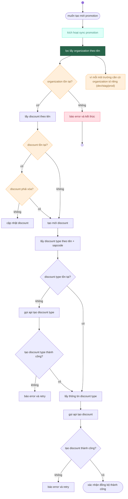
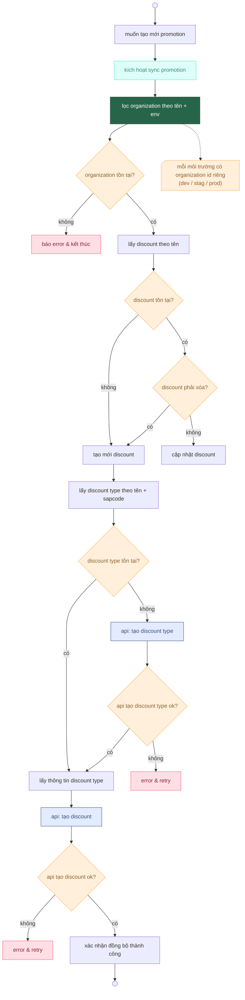

## thử nghiệm

```mermaid
---
config:
  layout: dagre
---
flowchart TB
    on["Filled Circle"] --> start(["muốn tạo mới promotion"])
    start --> sync["kích hoạt sync promotion"]
    sync --> org["lọc lấy organization theo tên"]
    org --> org_exist{"organization tồn tại?"} & note-org["vì mỗi môi trường cần có organization id riêng (dev/stag/prod)"]
    org_exist -- không --> err1["báo error và kết thúc"]
    org_exist -- có --> dis["lấy discount theo tên"]
    dis --> dis_exist{"discount tồn tại?"}
    dis_exist -- có --> del{"discount phải xóa?"}
    del -- không --> update["cập nhật discount"]
    del -- có --> create_dis["tạo mới discount"]
    dis_exist -- không --> create_dis
    create_dis --> dtype["lấy discount type theo tên + sapcode"]
    dtype --> dtype_exist{"discount type tồn tại?"}
    dtype_exist -- không --> api_dtype["gọi api tạo discount type"]
    api_dtype --> ok_dtype{"tạo discount type thành công?"}
    ok_dtype -- không --> retry1["báo error và retry"]
    ok_dtype -- có --> info_dtype["lấy thông tin discount type"]
    dtype_exist -- có --> info_dtype
    info_dtype --> api_dis["gọi api tạo discount"]
    api_dis --> ok_dis{"tạo discount thành công?"}
    ok_dis -- không --> retry2["báo error và retry"]
    ok_dis -- có --> done(["xác nhận đồng bộ thành công"])
    err1 --> off["Frames Circle"]

    on@{ shape: f-circ}
    note-org@{ shape: card}
    off@{ shape: fr-circ}
     sync:::Aqua
     org:::Pine
     org_exist:::Peach
     note-org:::Peach
     err1:::Rose
     dis_exist:::Peach
     del:::Peach
    classDef Sky stroke-width:1px, stroke-dasharray:none, stroke:#374D7C, fill:#E2EBFF, color:#374D7C
    classDef Aqua stroke-width:1px, stroke-dasharray:none, stroke:#46EDC8, fill:#DEFFF8, color:#378E7A
    classDef Pine stroke-width:1px, stroke-dasharray:none, stroke:#254336, fill:#27654A, color:#FFFFFF
    classDef Rose stroke-width:1px, stroke-dasharray:none, stroke:#FF5978, fill:#FFDFE5, color:#8E2236
    classDef Peach stroke-width:1px, stroke-dasharray:none, stroke:#FBB35A, fill:#FFEFDB, color:#8F632D
```
## mẫu chuẩn

```mermaid
---
config:
  layout: dagre
---
flowchart TB

%% ========== entry ==========
on(( )) --> start["muốn tạo mới promotion"]
start --> sync["kích hoạt sync promotion"]:::Aqua

%% ========== organization ==========
sync --> org["lọc organization theo tên + env"]:::Pine
org --> org_ok{"organization tồn tại?"}:::Peach
org_ok -- không --> err_org["báo error & kết thúc"]:::Rose
org_ok -- có --> dis

note_org["mỗi môi trường có organization id riêng<br/>(dev / stag / prod)"]:::Peach
org -.-> note_org

%% ========== discount ==========
dis["lấy discount theo tên"] --> dis_ok{"discount tồn tại?"}:::Peach

dis_ok -- không --> create_dis
dis_ok -- có --> del{"discount phải xóa?"}:::Peach

del -- không --> update["cập nhật discount"]
del -- có --> create_dis["tạo mới discount"]

%% ========== discount type ==========
create_dis --> dtype["lấy discount type theo tên + sapcode"]
dtype --> dtype_ok{"discount type tồn tại?"}:::Peach

dtype_ok -- có --> dtype_info["lấy thông tin discount type"]
dtype_ok -- không --> api_dtype["api: tạo discount type"]:::Sky

api_dtype --> api_dtype_ok{"api tạo discount type ok?"}:::Peach
api_dtype_ok -- không --> retry_type["error & retry"]:::Rose
api_dtype_ok -- có --> dtype_info

%% ========== create discount ==========
dtype_info --> api_dis["api: tạo discount"]:::Sky
api_dis --> api_dis_ok{"api tạo discount ok?"}:::Peach
api_dis_ok -- không --> retry_dis["error & retry"]:::Rose
api_dis_ok -- có --> done["xác nhận đồng bộ thành công"]

done --> off(( ))

%% ========== styles ==========
note_org@{ shape: card}
classDef Sky stroke:#374D7C, fill:#E2EBFF, color:#374D7C
classDef Aqua stroke:#46EDC8, fill:#DEFFF8, color:#378E7A
classDef Pine stroke:#254336, fill:#27654A, color:#FFFFFF
classDef Rose stroke:#FF5978, fill:#FFDFE5, color:#8E2236
classDef Peach stroke:#FBB35A, fill:#FFEFDB, color:#8F632D
```